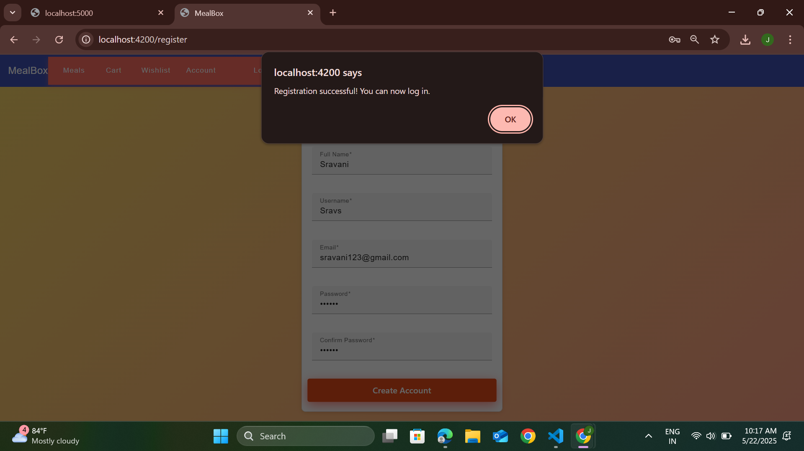
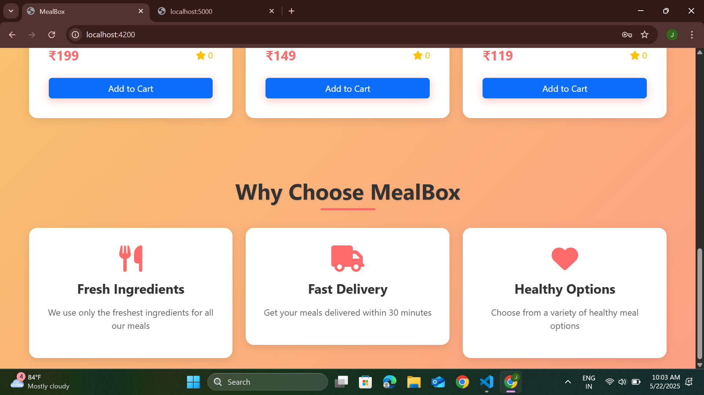

# MealBox Indian Food Delivery Application
A full-stack Indian food delivery application built with Angular and ASP.NET Core.

## Features
- User authentication and authorization with JWT
- Browse meals and categories
- Shopping cart and wishlist management
- Secure order placement and order history
- Responsive design for various devices
- Role-based authorization for secure API endpoints

## Prerequisites

### Backend (.NET Core)
- .NET 6.0 SDK or later
- SQLite
- Visual Studio 2022 or VS Code
- Node.js and npm (for running the frontend)

### Frontend (Angular)
- Node.js (v18 or later)
- npm (v9 or later)
- Angular CLI (v15 or later)

## Project Structure
```
MealBox-API-main/
├── backend/                 # ASP.NET Core Web API backend
│   ├── Controllers/         # API controllers
│   ├── Data/                # Database context and seeders
│   ├── Models/              # Entity models
│   ├── Services/            # Business logic services
│   ├── Startup.cs           # Backend configuration
│   ├── Program.cs           # Backend entry point
│   └── README.md            # Backend specific documentation
├── frontend/                # Angular frontend application
│   ├── src/                 # Source code
│   ├── angular.json         # Angular CLI configuration
│   ├── package.json         # Frontend dependencies
│   └── README.md            # Frontend specific documentation
├── README.md                # Root project documentation
├── package.json             # Root dependencies (if any)
└── MealBox-API.sln          # Solution file for backend
```

## Setup Instructions

### Backend Setup
1. Navigate to the backend directory:
   ```bash
   cd backend
   ```
2. Restore .NET packages:
   ```bash
   dotnet restore
   ```
3. Build the project:
   ```bash
   dotnet build
   ```
4. Apply database migrations:
   ```bash
   dotnet ef database update
   ```
5. Run the backend API:
   ```bash
   dotnet run
   ```
The API will be available at `https://localhost:5000`.

### Frontend Setup
1. Navigate to the frontend directory:
   ```bash
   cd frontend
   ```
2. Install dependencies:
   ```bash
   npm install
   ```
3. Run the development server:
   ```bash
   ng serve
   ```
The frontend app will be available at `http://localhost:4200`.

## Environment Configuration

### Backend
Create an `appsettings.json` file in the backend directory with the following structure:
```json
{
  "ConnectionStrings": {
    "DefaultConnection": "Data Source=mealbox.db"
  },
  "Jwt": {
    "Key": "your-secret-key-here",
    "Issuer": "your-issuer",
    "Audience": "your-audience"
  }
}
```

### Frontend
Update the `environment.ts` file in `src/environments/` with your API URL:
```typescript
export const environment = {
  production: false,
  apiUrl: 'http://localhost:5000/api'
};
```

## API Endpoints

### Authentication
- `POST /api/auth/register` - Register a new user
- `POST /api/auth/login` - Login user
- `POST /api/auth/refresh-token` - Refresh JWT token

### Meals and Categories
- `GET /api/meals` - Get all meals
- `GET /api/meals/{id}` - Get meal by ID
- `GET /api/categories` - Get all categories

### Cart
- `GET /api/cart` - Get user's cart
- `POST /api/cart/items` - Add item to cart
- `PUT /api/cart/items/{id}` - Update cart item
- `DELETE /api/cart/items/{id}` - Remove item from cart
- `DELETE /api/cart` - Clear cart

### Orders
- `POST /api/orders` - Create new order
- `GET /api/orders` - Get user's orders
- `GET /api/orders/{id}` - Get order by ID

### Wishlist
- `GET /api/wishlist` - Get user's wishlist
- `POST /api/wishlist/items` - Add item to wishlist
- `DELETE /api/wishlist/items/{id}` - Remove item from wishlist

### Coupons
- `GET /api/coupons` - Get available coupons
- `POST /api/coupons/redeem` - Redeem a coupon

## Development

### Running Tests

#### Backend
```bash
dotnet test
```

#### Frontend
```bash
ng test
```

### Building for Production

#### Backend
```bash
dotnet publish -c Release
```

#### Frontend
```bash
ng build --configuration production
```

## Contributing
1. Fork the repository
2. Create a feature branch
3. Commit your changes
4. Push to the branch
5. Create a Pull Request

## Screenshots







## License
This project is licensed under the MIT License.


## Contact
For any inquiries or support, please contact us at
Email:21a31a4417.pragati@gmail.com


## About
MealBox is a full-stack food delivery application built with Angular and ASP.NET Core, designed to provide a seamless user experience for browsing meals, managing orders, and account management.
